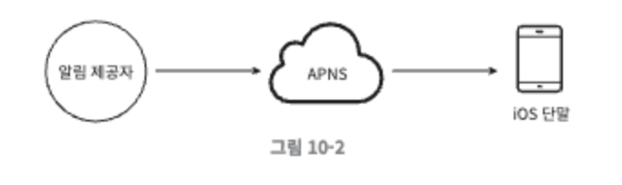
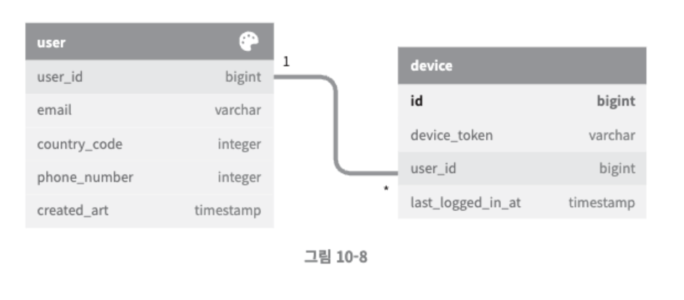
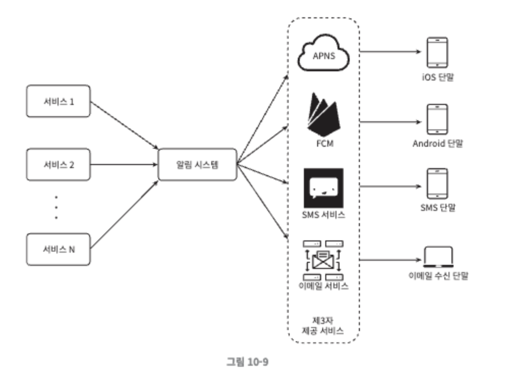
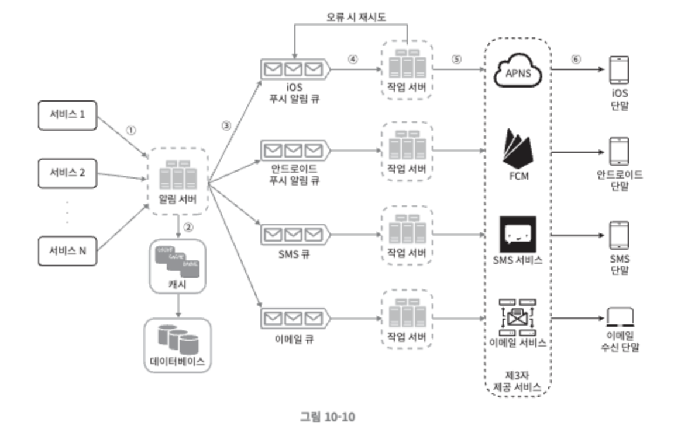
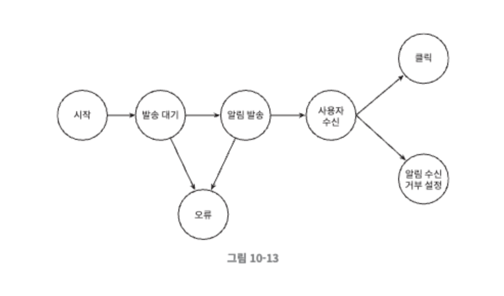
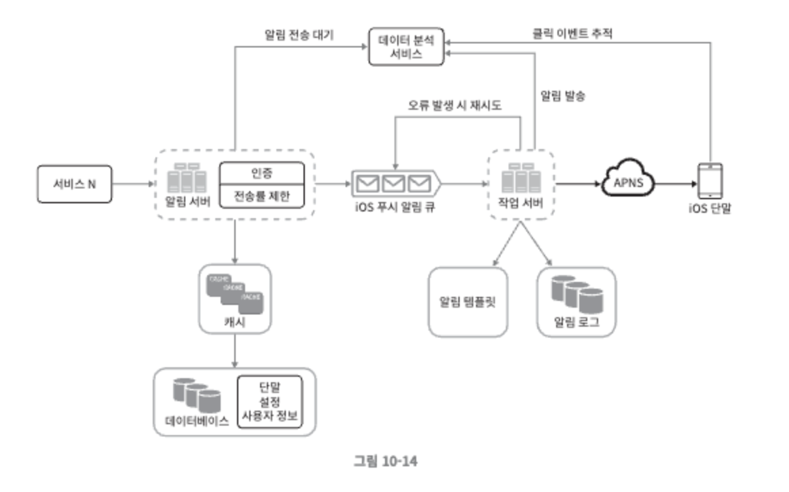

# 알림 시스템 설계

## 알림 유형별 지원 방안



여러 알림 유형이 존재하지만, 대략적으로 위와 같이 3개의 컴포넌트로 구성

- 알림 제공자 - 앱 서비스
    - 필요 정보
        - 단말 토큰
        - 페이로드 - 알림 데이터
- 알림 서비스 - 단말기에 알림을 보내주는 알림 서비스
- 유형별 단말기 - 알림을 수신할 단말기

알림 유형으로 아래 4가지가 있고 알림서비스만 크게 달라짐

1. ios 푸시 알림
    - 알림 서비스 - APNS(Apple Push Notification Service)
2. 안드로이드 푸시 알림
    - 알림 서비스 - FCM(Firebase Cloud Messaging)
3. sms 메시지
    - third-party 알림 서비스
        - 트윌리오
        - 넥스모
4. 이메일
    - third-party 알림 서비스
        - 센드그리드
        - 메일침프

## 연락처 정보 수집 절차

알림을 보내기 위해서는 사용자의 단말 토큰, 전화번호, 이메일 주소 등이 필요하다.

위 정보들은 사용자 별로 알람을 보낼때마다 필요하기 때문에 데이터 베이스에 저장한다.



## 알림 전송 및 수신 절차

개략적 설계 (초안)



문제점

- SPOF - 알림 시스템 서버가 하나만 존재하여, 단일 장애 지점이 생긴다.
- 규모 확장성 - DB나 캐시등의 중요 컴포넌트 규모 확장을 할 수 없다.
- 성능 병목 - 하나의 알림 시스템 서버에게 모든 트래픽이 몰려 과부하 상태에 빠질수 있다.

개략적 설계 (개선안)



- 알림서버
    - 알림 데이터 질의(DB or 캐시)
    - 메세지 큐에 저장
- 캐시
    - 자주 사용되는 DB데이터를 캐싱한다.
- 데이터베이스
    - 사용자 정보 (전화번호, 단말 정보), 알림 템플릿, 사용자 알림 설정 등을 저장
- 메시지 큐
    - 알림 서버와 작업 서버간의 의존성을 제거

# 상세 설계

## 안전성

1. 데이터 손실 방지
    - 알림 유실에 대한 대비책으로서, 알림 데이터를 DB에 보관 및 재시도
2. 알림 중복 전송 방지
    - 중복 전송을 완전히 막는것은 불가능
    - 빈도를 줄이기 위해서, 이미 처리된 이벤트인지 체크

## 추가 컴포넌트

1. 알림 템플릿
    - 비슷한 문구에 대한 템플릿 작성

        ```
        제목 : 지금 [item_name]을 주문하세요!

        본문 : [item_name]이 다시 입고 되었습니다! [date]까지만 주문 가능합니다!
        ```

2. 알림 설정
    - 사용자의 알림 설정에 따른 알림 발송 처리
3. 전송률 제한
    - 사용자 경험을 방해하지 않기 위한 전송률 설정
4. 재시도 방법
    - third-party 서비스에서 알림 실패 → 알림 재시도 전용 큐
    - 계속 실패시 개발자에게 통지
5. 푸시 알림과 보안
    - appKey와 appSecret을 통한 보안 유지
6. 큐 모니터링
    - 큐에 이벤트들이 많이 쌓이면 컨슈머 늘리기
7. 이벤트 추적
    - 사용자의 알림 확인율, 클릭율 지표 쌓기 → 사용자 이해에 중요

   


## 수정된 설계안

