# 13장 검색어 자동완성 시스템

# 1. 설계 범위

## 1.1 요구사항

- 빠른 응답 속도
- 연관성
- 정렬
- 규모 확장성
- 고가용성

## 1.2 개략적 규모 추정

- DAU - 천만
- 사용자 - 하루 10회 검색
- 질의문 평균 4개 단어, 단어는 평균 5글자로 가정

  → 1회당 20번의 요청

- 질의문 20% 는 신규데이터

### 1.2.1 도출결과

- 평균 QPS : 24,000
    - (천만 * 10 * 20)/ ( 24*3600)
- 최대 QPS : 48,000
    - 평균 QPS의 2배
- 매일 저장되는 신규 데이터 : 0.4 GB
    - 24000 바이트 * 0.2

# 2. 초반 설계

## 2.1 데이터 수집 서비스

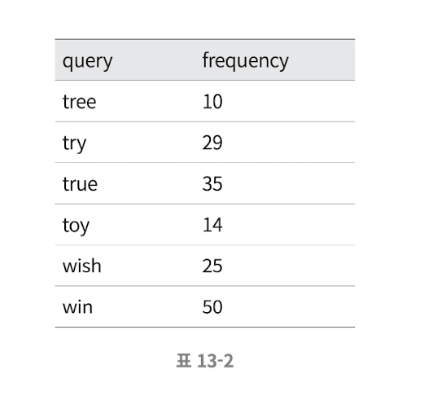

## 2.2 질의 서비스

```sql
SELECT * FROM frequency_table 
WHERE query Like `prefix%`
ORDER BY frequency DESC
LIMIT 5
```

# 3. 상세설계

- 트라이 자료 구조
- 데이터 수집 서비스
- 질의 서비스
- 규모 확장 가능한 구조

## 3.1 트라이 자료 구조

초반 설계에서 사용한 RDB를 통한 검색어 추천은 그다지 효율적이지 못함

수많은 요청에 빠른 응답속도를 제공하기 위해서 트라이(trie)라는 자료구조를 활용.

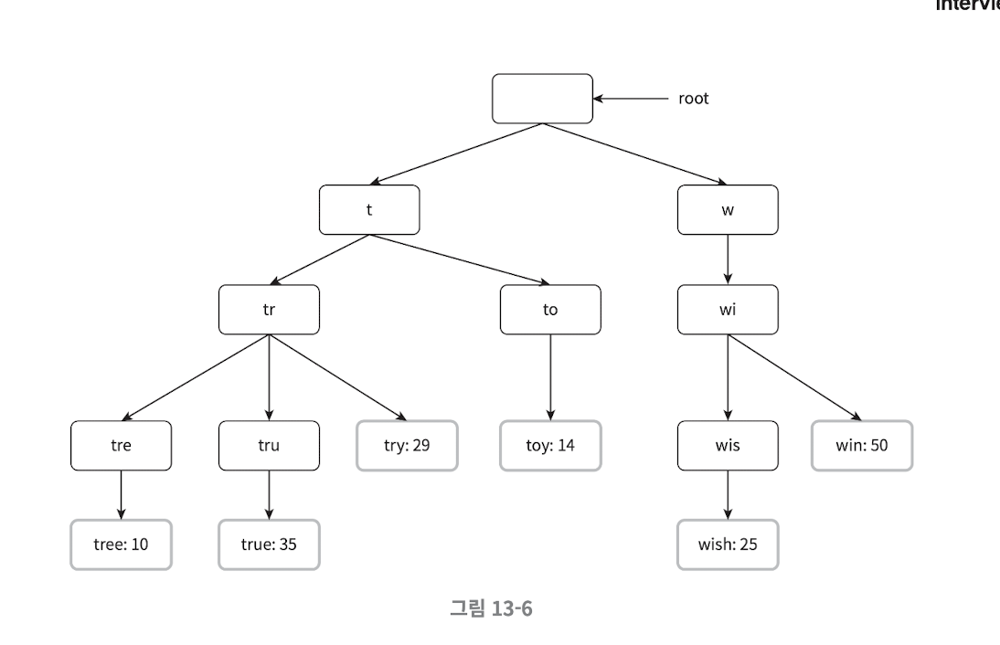

### 3.1.1 트라이 자료 구조에서 사용하는 용어

- p : 접두어(prefix) 길이
- n : 트라이 안에 있는 노드 개수
- c : 주어진 노드의 자식 노드 개수

### 3.1.2 검색어 k개 추천 소요시간

- 해당 접두어에 해당하는 노드를 찾는다 - O(p)
- 해당 노드부터 시작하는 하위 트리노드를 찾는다 - O(c)
- 유효 노드들을 정렬하여 가장 인기있는 노드 k개를 찾는다 - O(clogc)

  → 총 O(p) + O(c) + O(clogc)


- 예시
    - 2개의 검색어를 추천해줄 것이고, 검색창에 ‘be’를 입력했다고 가정

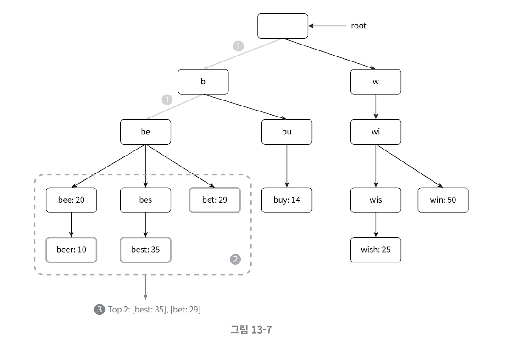

1. be 노드를 찾는다
2. 하위 노드를 찾는다.
3. 하위 노드를 정렬하여 상위 2개 노드를 찾는다.

→ 데이터가 많아지면 많아질수록 느려지는 시스템이다.

### 3.1.3 해결방안

- 접두어 최대 길이 제한
    - O(p) → O(1)
- 노드에 인기 검색어 캐싱
    - O(c) + O(clogc) → O(1)

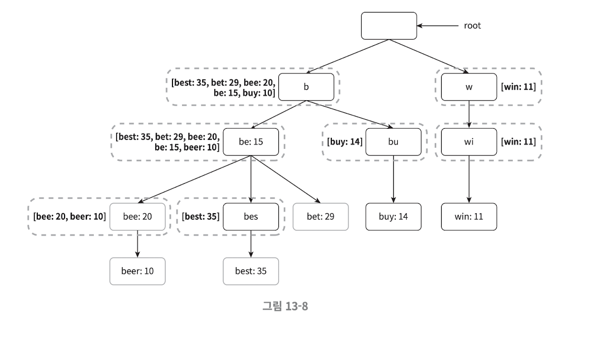

## 3.2 데이터 수집 서비스 상세 설계

앞서 살펴본 수집서비스는 질의가 요청될때마다 실시간으로 데이터를 수정했지만 아래와 같은 문제가 발생

- 매일 수천만건의 트라이가 갱신된다면 질의 서비스는 심각하게 느려짐
- 트라이가 만들어지고 나면, 인기검색어는 그다지 자주 바뀌지 않기에 자주 갱신할 필요가 없음

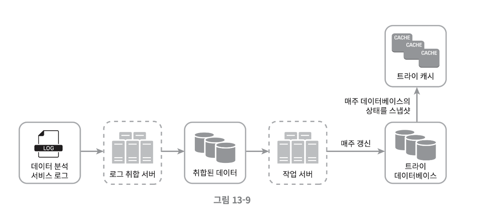

### 3.2.1 데이터 분석 서비스 로그

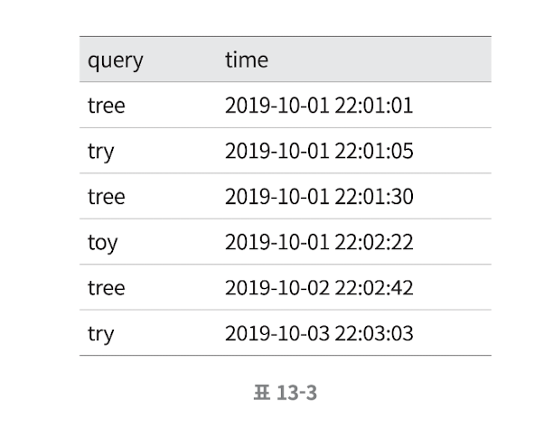

### 3.2.2 로그 취합 서버 & 취합 데이터

원하는 취합 주기에 따라 데이터 취합

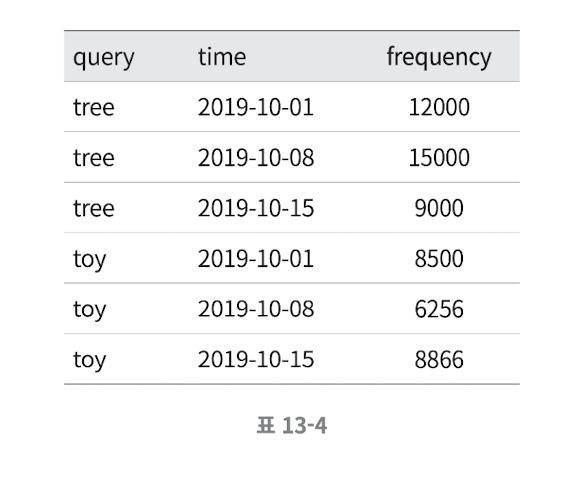

### 3.2.3 작업서버

트라이 자료구조를 만들고, 설정한 주기마다 트라이 데이터베이스에 저장

### 3.2.4 트라이 캐시

설정한 주기마다 트라이 데이터베이스의 스냅샷을 떠서 갱신

### 3.2.5 트라이 데이터 베이스

- 문서 저장소 (몽고디비?)
- key-value 저장소

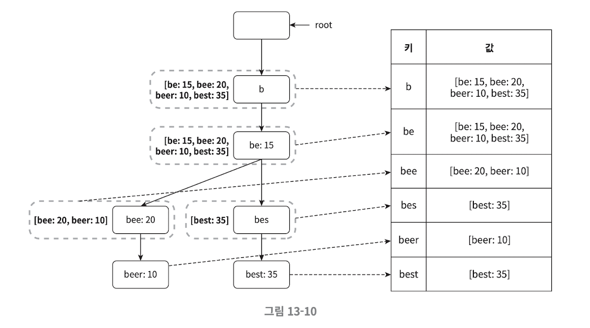

## 3.3 질의 서비스 상세설계

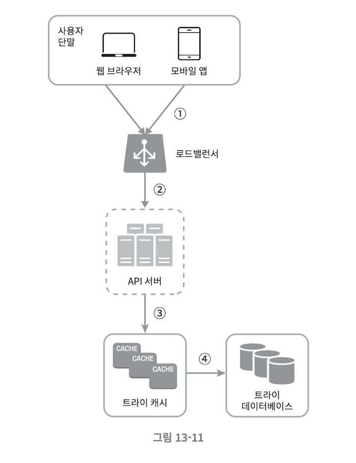

### 3.3.1 단계

- 1,2,3 단계
    - 로드밸러싱 및 API 요청
- 4단계
    - 데이터가 트라이 캐시에 없는 경우 트라이 데이터베이스에서 가져와 캐시 갱신
    - 캐시 서버 메모리 부족으로 캐시 미스가 생길수 있기 때문

### 3.3.2 최적화

- 브라우저 캐싱 사용

  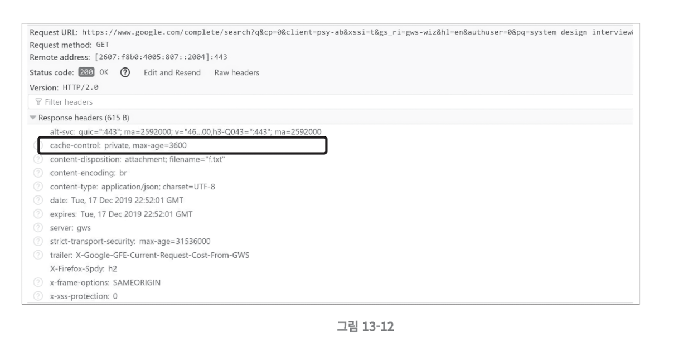

- 데이터 샘플링
    - 대규모 시스템의 경우 모든 질의 결과를 로깅하면 CPU 자원과 저장공간 소모가 큼
    - N개 요청 가운데 1개만 로깅

## 3.4 저장소 규모 확장
트라이의 크기가 한 서버에 넣기 너무 커질때, 규모 확장성을 위해 샤딩을 고려해 볼 수 있음.

- 처음에는 알파벳을 가용할 수 있는 서버 수로 나누어서 샤딩한다.
- 트라이의 크기가 너무 커서 26개(알파벳 개수) 이상으로 서버가 필요하다면, 계층구조로 나눈다.
  - aa ~ ag : 첫번째 서버
  - ah ~ an : 두번째 서버...
- 알파벳마다 데이터 크기 차이가 심하면, 질의 데이터 패턴을 분석하여 샤딩

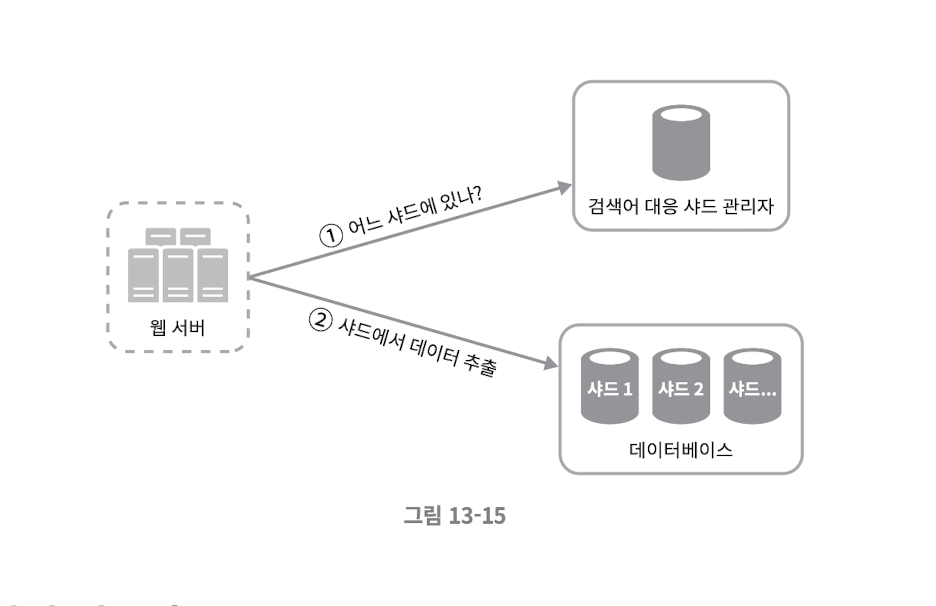