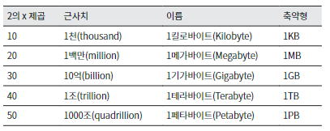

## 개략적인 규모 추산

> 보편적으로 통용되는 성능 수치상의 사고 실험을 통해 추정치를 계산하는 방법 
> 서비스에 어느 정도 규모의 서버가 필요한지, 어느 정도의 트래픽을 감당할 수 있는지 등을 예측하는데 사용한다.

-----------

## 규모 확장의 필요한 계산

- 2의 제곱수
- 응답지연속도
- 가용성 수치

-----

### 2의 제곱수

> 2의 제곱수는 컴퓨터의 메모리나 디스크의 크기를 나타내는 대표적인 단위로 사용된다. 
> 컴퓨터 계산의 가장 낮은 단위는 비트(bit)이다. 0과 1의 두 가지 값을 가지는 이진수의 최소 단위이다. 
> 

## 응답지연의 수치

> 응답지연의 수치는 서비스의 응답속도를 나타내는 단위이다. 
> 응답지연의 수치는 초 단위로 표현되며,   
> 1초는 1,000밀리초(ms)이다. 
> 1ms는 1,000마이크로초(μs)이다. 
> 1μs는 1,000나노초(ns)이다. 

| 기호 |  단위   | 초 단위        | 
|:--:|:-----:|:------------|
| s  |   초   | 1           |
| ms |  밀리초  | 0.001       |
| μs | 마이크로초 | 0.000001    |
| ns |  나노초  | 0.000000001 |

> 우리가 현업에서 사용하는 서비스의 응답속도는 보통 1초 이내이다. 
> 예를 들어 쿼리의 응답 속도가 ms 범주를 벗어 나는 경우 서비스의 성능이 떨어진다고 판단할 수 있다. 
> 응답속도가 최대 3초를 넘어가는 경우 사용자가 서비스를 떠날 확률이 높아지기 때문이다. 
> 이런 문제를 개선하기 위해 서비스의 응답속도를 개선하는 작업을 진행한다. 
> 이런 작업 시에 응답 속도를 알고 있는 것이 도움된다.

| 연산명                          | 시간                  | 참고                      |
|:-----------------------------|:--------------------|-------------------------|
| L1 캐시 참조                     | 0.5ns               | CPU Level 1 Cash Memory |
| 분기 예측 오류                     | 5ns                 |                         |
| L2 캐시 참조                     | 7ns                 | CPU Level 2 Cash Memory |
| 뮤텍스 락/언락                     | 100ns               |                         |
| 주 메모리 참조                     | 100ns               | rem memory              |
| 1KB 압축                       | 10,000ns = 10us     |                         |
| 1Gbps 네트워크로 2KB 전송           | 20,000ns = 20us     |                         |
| 메모리에서 1MB 순차적으로 read         | 250,000ns = 250us   |                         |
| 디스크 탐색                       | 10,000,000ns = 10ms | HDD 탐색                  |
| 네트워크에서 1MB 순차적으로 read        | 10ms                |                         |
| 디스크에서 1MB 순차적으로 read         | 30ms                |                         |
| 패킷의 캘리포니아로부터 네델란드까지의 왕복 지연시간 | 150ms               |                         |

> 서울에서 부산까지의 대략적인 응답 속도 계산

- 단방향 지연 시간 계산:
    - 광섬유 내 데이터 전송 속도: 210,000 km/s
    - 서울에서 부산까지 거리: 325 km
    - 단방향 지연 시간: 325 km / 210,000 km/s = 1.5 ms
    - 0.001547619 초 (1.5ms)
- 양방향은 이 값에 2를 곱한다.
    - 0.003095238 초 (3ms)

> 이론적으로 서울에서 부산까지의 왕복 지연 시간은 3ms이다. 
> 이 계산은 하나의 패킷을 전제로 한다. 

- 5mb 크기의 데이터
    - 5mb = 5(mb)×1024(kb)×1024(byte) = 5,242,880(byte)
    - (최소)3495.25 패킷

#### 결론

- 메모리 읽기 속도는 디스크 읽기 속도보다 빠르다.
- 디스크 탐색은 가능한 피하자
- 압축 알고리즘을 빠른 편이다.
- 데이터를 네트워크로 전송 시 압축하는 것도 고려할만 하다.
    - API 서버에서 GZIP 알고리즘을 통한 JSON 문자열 압축등 ,
    - 이미지 파일을 CDN을 통해 전송하는 경우 이미지 파일을 압축하여 전송한다.
    - 로그 데이터를 전송하는 경우에도 압축을 고려한다.
    - 데이터베이스 동기화
- 물리적 거리도 고려의 대상이 될만 하다.

-----

-----

## 가용성 수치

> 가용성 수치는 서비스의 가용성을 나타내는 단위이다. 
> 가용성 수치는 백분율로 표현되며, 100%를 기준으로 한다. 

| 가용률     | 장애시간(하루)  | 장애시간(년) |
|:--------|:----------|:--------|
| 99%     | 14.40분    | 3.65일   |
| 99.9%   | 1.44분     | 8.77시간  |
| 99.99%  | 8.64초     | 52.60분  |
| 99.999% | 864.00밀리초 | 5.26분   |

### 시나리오

#### **가정**

- MAU(월간 활성 사용자) 300,000,000명(3억명)
- 50%의 사용자가 서비스를 매일 사용한다. (1.5억)
- 평균적으로 각 사용자는 매일 2건의 트윗을 올린다 (트윗수 : 3억건)
- 미디어를 포함하는 트윗은 10% 정도다 (미디어 포함 트윗 : 3000만건)
- 데이터는 5년간 보관된다 (5년간 데이터 : 5475억건)

QPS(Query Per Second) 추정치

- 일간 능동 사용자 = 3억 * 50% = 1.5억
- QPS = 1.5억 * 2 트윗 / 24시간 / 1분(3600초) = 약 3500
- 최대 QPS = 3500 * 2 = 약 7000

미디어 저장을 위한 저장소 요구량

- 평균 트윗 크기(avg)
    - tweet_id 에 64바이트
    - 텍스트에 140바이트
    - 미디어에 1MB
- 미디어 저장소 요구량: 1.5억 2(개) 10% * 1MB = 30TB/일
- 5년간 미디어를 보관하기 위한 저장소 요구량: 30TB 365일 5년 = 약 55PB

### 가용성을 위한 솔루션

가용성은 얼마나 안정적으로 서비를 제공할 수 있는지를 나타내는 지표이다. 
이를 위해 안정성을 보장하기 위한 방법들은 여러가지 있는데 
가장 대표적인 것이 **분산**이다  

가용성이 떨어지는 이유는 사용자가 서비스를 이용하지 못하기 때문인대 
이를 해결하기 위해 여러 서버를 두어 사용자가 문제를 인지하고 못하고 서비스를 이용할 수 있도록 하는 것이다. 

## 분산 시스템의 종류

분산 시스템은 서비스의 가용성을 높이고, 장애에 대한 내성을 강화하기 위해 널리 사용된다.

1. 지리적 분산 (Geographical Distribution)
    - 서비스를 여러 지역 또는 국가에 걸쳐 분산시키는 방법. 자연 재해, 지역적 네트워크 문제 등 특정 지역의 문제가 전체 서비스에 영향을 미치지 않도록 한다.

2. 로드 밸런싱 (Load Balancing)
    - 트래픽을 여러 서버에 균등하게 분산시켜, 단일 서버의 과부하를 방지. 로드 밸런서는 들어오는 요청을 여러 서버에 분산시켜 처리 능력을 극대화.

3. 데이터 복제 (Data Replication)
    - 중요 데이터를 여러 서버 또는 데이터 센터에 복제하여 저장. 데이터 손실 위험을 줄이고, 데이터 접근성을 향상.

4. 클라우드 서비스 (Cloud Services)
    - 클라우드 기반 서비스를 사용하여 인프라의 유연성을 높이고, 자원을 필요에 따라 쉽게 확장하거나 축소할 수 있다.

5. 마이크로서비스 아키텍처 (Microservices Architecture)
    - 대규모 어플리케이션을 작은, 독립적으로 운영 가능한 서비스로 분할. 각 서비스가 독립적으로 실패하거나 확장될 수 있게 하여 전체 시스템의 가용성을 향상.

6. 재해 복구 계획 (Disaster Recovery Planning)
    - 재해 발생 시 데이터와 서비스를 복구하기 위한 계획을 수립. 백업, 데이터 복구 절차, 긴급 운영 센터 설정 등을 포함할 수 있다.
