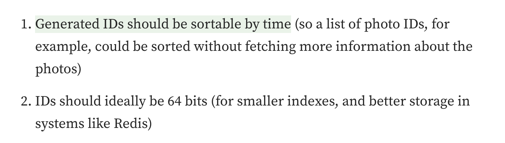
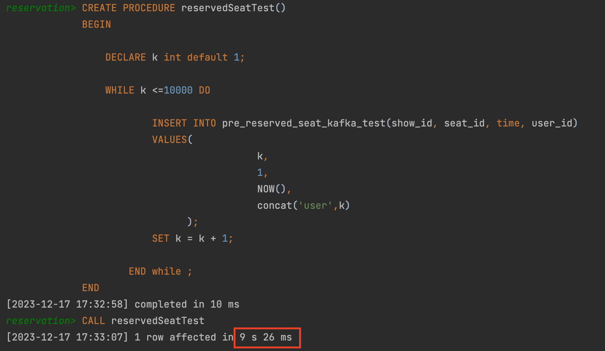
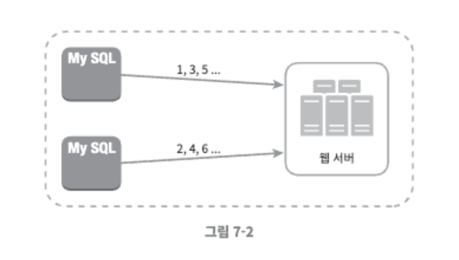
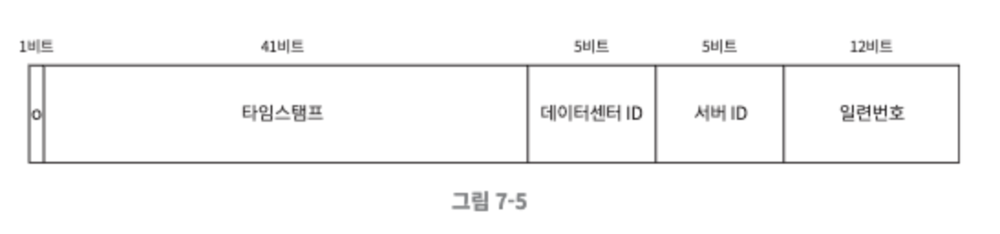

# ID 설계 예제 문제 조건

> 1. 유일  
> 2. 숫자로만 구성  
> 3. 64비트  
> 4. 시간순 정렬 가능  
> 5. 초당 10,000개 생성 가능

< 인스타그램 id shading 조건에 대한 근거 >

- 시간순 정렬 - 사진의 더 많은 정보들을 fetch하지 않고, 바로 id로만으로 정렬하기 위해
- 64비트 - redis와 같은 시스템에서 더 작은 인덱스와 나은 저장공간을 위해

< 로컬 DB 테이블에 레코드 10,000개 적재 소요 시간 - 9.26초 >

- 초당 10,000개 생성 가능 - DB 서버 다중화 필요를 의미

# 솔루션

## 1. 다중 마스터 복제

방법
- DB auto_increment 기능을 활용
- 서버 개수만큼 id 값 증가

장점
- 쉬운 구현
- 유일성 보장

단점
- 여러 데이터센터에 걸쳐 규모 확정 어려움
- 서버가 추가되거나 삭제되었을 때 동작하기 힘듬

## 2. UUID

방법
- 중복 uuid가 생길 확률 50% = 초당 10억개의 uuid를 100년동안 계속 생성
- 중복될 일이 매우 적은 uuid를 각 서버에서 각자 맘대로 생성

장점
- uuid를 생성하기 매우 쉬움
- 다른 서버를 신경쓸 필요가 없어 규모 확장에 있어 매우 유리

단점
- 높은 고유성을 보장하기 위해서 최소 96비트 이상
- 시간순 정렬 불가
- ID에 숫자 포함

## 3. 티켓 서버

방법
- 요청이 들어올 때마다, auto_increment를 하는 하나의 중앙 서버(=티켓서버)를 둠.
- 각각의 웹 서버들이 티켓서버에게 id를 발급받고, 그 id를 db에 insert함

장점

- 쉬운 구현
- 유일성 보장

단점

- 단일 장애 지점

## 4. twitter snowflake

방법
- 64비트를 쪼개어 각각의 기능을 분할해서 저장
    - 1비트 : 부호
    - 41비트 : 사용자 지정시간으로부터 69년
    - 5비트 : 데이터센터 ID (32개)
    - 5비트 : 서버 ID (32개)
    - 12비트 : 일련번호 4096개 생성 가능

장점

- 유동적으로 각 기능에 대한 저장공간 설계 가능

단점

- 데이터 센터나 서버 ID에 변경 작업이 있을 때, 잘못 변경시 id 충돌 발생

## 추가. instagram
방법
- twitter snowflake와 유사
    - 41비트 : 사용자 지정시간으로부터 69년
    - 13비트 : 논리적 샤드 ID
    - 10비트 : 자동 증가 시퀀스(=일련번호) 1024개 생성 가능

## 참고
[Sharding & IDs at Instagram](https://instagram-engineering.com/sharding-ids-at-instagram-1cf5a71e5a5c)
